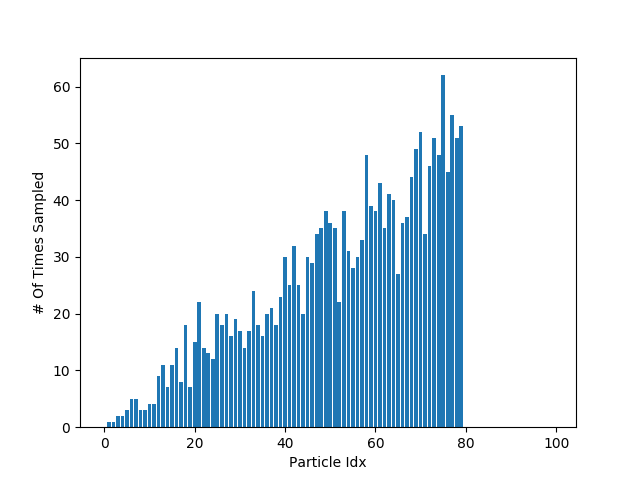

## 5.1 Motion Model (20 Points)

### 1. Run the code that visualizes your motion model three times. For each run, choose a test speed, steering angle, and time interval that result in different robot motions. Submit the visualizations for all three runs.

Run 1 : speed = 1.0, steering angle = 0.34, time interval = 1.0,

*Visualization for Run 1*

Run 2 : speed = 1.0, steering angle = 0.0, time interval = 1.5,

*Visualization for Run 2*

Run 3 : speed = 0.8, steering angle = -0.2, time interval = 0.5,

*Visualization for Run 3*

### 2. How did you initially choose the noise parameter values?

We chose a standard deviation of 1 as the initial value for all noise parameters. We started with simple (default) values that we could then tune for performance. 

### 3. After picking the initial values, did you tune them? If yes, how so?

We tuned the parameters after picking the initial values by varying each of them independently to optimize each parameter with others held constant.

### 4. What were your final values for these parameters?

Our final values for these parameters are as follows:
- Kinematic car velocity noise std dev: KM_V_NOISE = 0.05
- Kinematic car delta noise std dev: KM_DELTA_NOISE = 0.3
- Kinematic car x position constant noise std dev: KM_X_FIX_NOISE = 0.01
- Kinematic car y position constant noise std dev: KM_Y_FIX_NOISE = 0.01
- Kinematic car theta constant noise std dev: KM_THETA_FIX_NOISE = 0.01

## 5.2 Sensor Model (20 Points)

### 1. Run the code that visualizes your sensor model on each of the three provided laser scan bags. Submit the visualizations for all three runs.

laser_scan1.bag:

*Visualization for laser_scan1.bag*

laser_scan2.bag:

*Visualization for laser_scan2.bag*

laser_scan3.bag:

*Visualization for laser_scan3.bag*

### 2. Answer: How did you initially chose the mixing weights? How did you initially choose the value of SIGMA HIT?

We chose a the values such that they sum up to 1.  Initially, the shorter range predictions need to be more precize, hence the weight value of 0.3 and the hit predictions need to be fairly good, hence 0.6. The random hit readings needs to be the least, hence 0.05 and the remaining was put into max readings.

### 3. Answer: After picking the initial values, did you tune them? If yes, how so?

We tuned the parameters after picking the initial values by varying pairs of them independently from the rest inorder to optimize each pairs of parameters with others held constant. We optimized each parameter paired with every other parameter to ensure optimal tuning.

### 4. Answer: What were your final values for these parameters?

Our final values for these parameters are as follows:
- Weight for short reading: Z_SHORT=  0.02
- Weight for long reading: Z_LONG=  0.17
- Weight for max reading: Z_MAX=  0.01
- Weight for hit reading: Z_HIT=  0.80

## 5.3 Re-Sampler (20 Points)

### 1. Run the code that visualizes the re-sampler with the trials parameter set to ten for both methods. Submit both visualizations.

The visualization for the re-sampler with trial parameter set to 10 are below:

*Visualization Naiive Default*

*Visualization low_variance Default*

### 2. Answer: Which of the two methods represents the true particle distribution better? How so?

The low variance distribution represents the true particle distribution better. Low variance resampling maintains diversity and prevents particle degeneracy are critical, especially in situations with a large number of particles. Hence low variance resampling is preferred despite its increased computational cost.

### 3. Increase the number of trials until the sampling methods starts representing the true particle distribution equally well. Submit the visualizations for both methods.

We tired increasing the trials to 20, 30, 40 and 50. The vosualization for these trials are below:

#### Trial = 20

*Visualization Naiive 20 trials*

*Visualization low_variance 20 trials*

#### Trial = 30

*Visualization Naiive 30 trials*

*Visualization low_variance 30 trials*

#### Trial = 40

*Visualization Naiive 40 trials*

*Visualization low_variance 40 trials*

### 4. Answer: At what number of trials did both methods begin to represent the true particle distribution well?

At around number of trials 50 the low variance sampling method starts representing the true particle distribution. The visualization for the re-sampler with trial parameter set to 50 are below:

*Visualization Naiive 50 trials*

*Visualization low_variance 50 trials*

## 5.4 Particle Filter (40 Points)

1. Record a video of your particle filter estimating the robot’s state when playing back the lab4/bags/real-
floor4 corridor/full 2x.bag file. Make sure to visualize all of the topics mentioned in Section 4.5.
Show your particle filter’s estimate of the expected pose in blue, and our recorded estimate in
green. Please playback and record the estimates for the whole bag (note that at one point the robot
pauses its movement, but then continues moving shortly afterwards). Your estimates will not exactly
match ours, but they should be similar at all times.

Answer: The visualization of the whole bag is uploaded

3. Record a video of your particle filter running successfully on the real robot. You should use the
cse basement map, and the video should both show your robot moving via teleoperation around the
basement. Any reasonable submission for this question will earn full credit, as long as we can reasonably
see the localization capabilities of your system.

Ans: The visualization is uploaded. 
