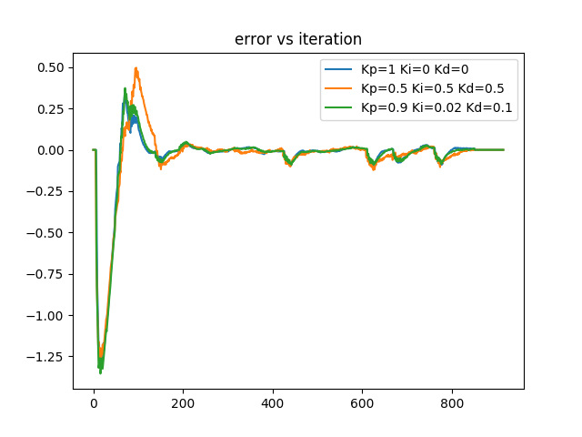

## 5.1 Line Following with PID Control

### What exactly was your error metric? How exactly did you choose which point the robot should navigate towards?

* The error metric for the PID controller was two folds:
 - the translational error metric as the cross track error
 - the rotational error metric as the absolute difference between the target orientation angle and car orientation

* We have randomly chose multiple points inside the `cse2_2.yaml` and the `small_basement.yaml` map and ran the linefollower code. We have chosen points that are difficult to reach, since robot will take multiple turns in following the path.

### What are the 3 sets of PID parameters that you choose? Which set of PID parameters performed best? Why do you think this is the case?

* The initial choice of parameters Kp = 1, Ki = 0 and Kd = 0 performs deecently while following the path in multiple scenarios. The 3 sets of parameters chosen for experimentation are:
 - Kp = 1, Ki = 0 and Kd = 0
 - Kp = 0.5, Ki = 0.5, Kd = 0.5
 - Kp = 0.9, Ki = 0.02, Kd = 0.1

* The Kp = 0.9, Ki = 0.02, Kd = 0.1 combination works the best. 

* In general, the Ki has a small value because it accumulates steady state error. The Kd values are higher than Ki values but it is used to dampen the oscillations intriduced by the proportional term. The major contribution of the control comes from proportional error constant Kp. Hence these sets of values make the mosts sense.

### What is missing that is stopping us from implementing this on the real robot? (Hint: given a trajectory in the real world, think about what the robot needs to know in order to calculate the error for PID)

For real-world implementation, the missing link is accurate sensor feedback. While simulation allows algorithm validation, real robots need precise sensor data (position, orientation) to calculate the PID error accurately. Real-world challenges like sensor noise and environmental variations (position of obstacles) impact performance, necessitating potential recalibration for successful deployment.

### Error Plot:

### Video
Videos in the same folder: `Task1sim_final_420.mov`

## 5.2 Wandering Around with MPC

### Describe the parameter values that you chose (e.g. T , delta incr, etc.). Describe any other design choices that you made
We tried different parameter values of `delta_incr`, `delta_min`, `delta_max` and `laser_offset`. The best parameter values that works are the following:
 - `min_delta = -0.19`
 - `max_delta =  0.19`
 - `delta_incr = 0.04`

We experimented with different values of T, but the default 300 works decent. Same with `laser_offset`

We initially considered reducing the speed parameter such that it takes the robot over a minute to run into the closest barrier, but in the end we decided to leave that parameter alone and optimize by tweaking the others. In the end, we found greatest performance with a 20 degree laser scan range. These decisions were largely made via guess-and-check in the virtual environment. 

### Videos
Videos in the same folder: Simulation: `task2_complete_480.mov`, Real world implementation: `VID_20231115_182956~2.mp4`

